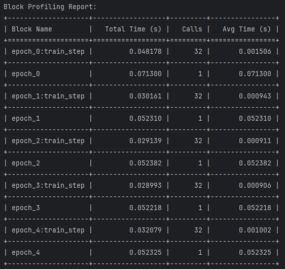

# Omni Profiler

[Previous content remains the same up to the Machine Learning Example section]

## Machine Learning Example

Omni Profiler can be particularly useful for profiling machine learning workflows. Here's an example of how to use Omni Profiler with a PyTorch-based neural network training process.

### Setup

First, import the necessary libraries and configure the profiler:

```python
import torch
import torch.nn as nn
import torch.optim as optim
from torch.utils.data import DataLoader, TensorDataset
import numpy as np
from improved_profiler import profiler, profile_methods, profile_line_by_line
from profiler_config import profiler_config

# Configure profiler
profiler_config.enabled = True
profiler_config.output_dir = "ml_profiling_output"
profiler_config.save_format = "json"
profiler_config.steps_to_save = [1, 10, 50, 100]
profiler_config.print_block_profile = True
profiler_config.print_line_profile = True
profiler_config.print_overall_profile = True
```

### Data Generation

We'll use a simple function to generate dummy data:

```python
@profile_line_by_line
def generate_data(num_samples=1000, input_dim=10):
    X = np.random.randn(num_samples, input_dim)
    y = np.sum(X, axis=1) > 0
    return torch.FloatTensor(X), torch.FloatTensor(y).unsqueeze(1)
```

### Model Definition

Here's a simple neural network model:

```python
class SimpleNN(nn.Module):
    def __init__(self, input_dim):
        super(SimpleNN, self).__init__()
        self.fc1 = nn.Linear(input_dim, 64)
        self.fc2 = nn.Linear(64, 1)
        
    def forward(self, x):
        x = torch.relu(self.fc1(x))
        x = torch.sigmoid(self.fc2(x))
        return x
```

### Trainer Class

We'll define a `Trainer` class with profiled methods:

```python
@profile_methods
class Trainer:
    def __init__(self, model, criterion, optimizer, train_loader, val_loader):
        self.model = model
        self.criterion = criterion
        self.optimizer = optimizer
        self.train_loader = train_loader
        self.val_loader = val_loader
    
    @profile_line_by_line
    def train_epoch(self, epoch):
        # Training logic here...
    
    @profile_line_by_line
    def validate(self):
        # Validation logic here...
    
    @profile_line_by_line
    def train(self, num_epochs):
        for epoch in range(num_epochs):
            with profiler.profile_context(f"epoch_{epoch}"):
                train_loss = self.train_epoch(epoch)
                val_loss = self.validate()
                print(f'Epoch {epoch}: Train Loss: {train_loss:.4f}, Val Loss: {val_loss:.4f}')
        
        profiler.print_overall_profile()
        profiler.print_block_profile()
        profiler.print_line_profile()
```

### Main Training Script

Here's how to put it all together:

```python
if __name__ == "__main__":
    # Generate data
    X_train, y_train = generate_data(1000, 10)
    X_val, y_val = generate_data(200, 10)
    
    # Create data loaders
    train_loader = DataLoader(TensorDataset(X_train, y_train), batch_size=32, shuffle=True)
    val_loader = DataLoader(TensorDataset(X_val, y_val), batch_size=32)
    
    # Initialize model, criterion, and optimizer
    model = SimpleNN(10)
    criterion = nn.BCELoss()
    optimizer = optim.Adam(model.parameters())
    
    # Create trainer and start training
    trainer = Trainer(model, criterion, optimizer, train_loader, val_loader)
    trainer.train(num_epochs=5)
```

### Profiling Results

After running the training script, Omni Profiler will output detailed profiling information. Here are some example visualizations of the profiling results:

#### Overall Profiling Report


This image shows the overall time spent in each profiled function, giving you a high-level view of where your code is spending the most time.

#### Block Profiling Report



The block profiling report provides information about the time spent in specific blocks of code, such as individual epochs or training steps.

#### Line-by-Line Profiling Report


This detailed report shows the time spent on each line of code, helping you identify specific bottlenecks in your functions.

## Interpreting Profiling Results

When analyzing the profiling results:

1. Look for functions or blocks that take the most time in the overall and block profiling reports.
2. Identify any unexpected patterns in the line-by-line profiling report, such as lines that take significantly longer than others.
3. Pay attention to the number of calls for each function or block to understand how frequently they're executed.
4. Compare the average time per call to identify slow operations that might benefit from optimization.

By using Omni Profiler in your machine learning projects, you can gain valuable insights into the performance characteristics of your training process, helping you optimize your code for faster execution and better resource utilization.

## Customizing Profiler Output

You can customize the profiler's output by modifying the `profiler_config` settings:

- Use `profiler_config.print_overall_profile = True/False` to enable/disable the overall profiling report.
- Use `profiler_config.print_block_profile = True/False` to enable/disable the block profiling report.
- Use `profiler_config.print_line_profile = True/False` to enable/disable the line-by-line profiling report.

Experiment with these settings to focus on the level of detail you need for your specific profiling tasks.

[Rest of the README remains the same...]
